# Actionist Builder Architecture

**Status:** design recommendation for the scoped Action Model client builder.  
**Scope:** Action Model clients describe dashboards/apps in chat; the platform assembles against platform-owned databases and policies; each client app previews in an isolated sandbox, is versioned in Git, and publishes to an `actionmodel.com` subdomain. This is not a general-purpose Lovable clone.

## 1. Constraints and evidence

### Direct observations

- The minimum product surface is **chat → constrained codegen → sandbox preview → Git-backed versions → subdomain publish**. (DIRECT: `../research/lovable-teardown-2026-08-26.md:73-75`.)
- Lovable built its own AWS/Kubernetes sandbox fleet and then abandoned it for Modal. (DIRECT: `../research/lovable-teardown-2026-08-26.md:7-11`.)
- The scoped case owns the deploy target, data layer, and design system; schema introspection replaces schema invention and platform-owned policies remove the LLM-authored-RLS exposure described in the teardown. (DIRECT: `../design/BLOCK-FRAMEWORK.md:96-116`; `../research/lovable-teardown-2026-08-26.md:35-39,77-80`.)
- The existing design makes the scaffold/registry the product boundary, uses conditional retrieval, validator gates, reversible state, and separate deployment contract tests. (DIRECT: `../design/BUILDER-DESIGN.md:31-44,47-64`; `../research/builder-architecture-intel-2026-08-25.md:70-91`.)
- The block contract already fixes the v0 composition boundary: versioned provenance, a runtime/styling/data stack contract, provided routes/components/migrations/env/events, dependency edges, design tokens, and build/smoke-test proof. (DIRECT: `../design/block-contract.schema.json:5-7,19-43,50-95,97-180`.)
- The repository pool contains 500 records, of which 302 are marked `declared_permissive`; the pool itself records SPDX and disposition fields. (DIRECT: `repo-pool.jsonl`; receipt in §2.)

### Architectural inference

The fastest safe v1 is a **platform-controlled application compiler**, not an open-ended code-writing agent. The model selects an allowed scaffold and emits bounded edits/glue; deterministic services own tenancy, schema access, policy enforcement, build execution, versioning, and deployment. This follows from the evidence above: generality is the incumbent's hard problem, while the requested product fixes the target schema, target host, and target component system.

## 2. Language question: test the Rust instinct

### Pool-language measurement

**Method (DIRECT):** read `repo-pool.jsonl`, filter `lic_state == declared_permissive`, select the first five records in each of the nine lane values (45 records total), then run `gh api repos/{owner}/{repo} --jq '[.full_name, (.language // "NONE")] | @tsv'`. This is a stratified, non-random sample; it is evidence about the sampled pool, not a census of all 302 records.

**Receipt — exact command:**

```sh
python3 - <<'PY'
import json, subprocess
from collections import Counter
p='/Users/shaansisodia/SISO_Workspace/SISO_Agency/clients/actionmodel/Actionist-AppSDK/SISO/design/feature-matrix/repo-pool.jsonl'
rows=[json.loads(l) for l in open(p) if json.loads(l).get('lic_state')=='declared_permissive']
picked=[]; seen=set()
for lane in sorted({r['lane'] for r in rows}):
    for r in rows:
        if r['lane']==lane and r['repo'] not in seen:
            picked.append(r); seen.add(r['repo'])
            if sum(x['lane']==lane for x in picked)>=5: break
for r in rows:
    if len(picked)>=45: break
    if r['repo'] not in seen: picked.append(r); seen.add(r['repo'])
langs=[]
print(f'SAMPLE_SIZE={len(picked)}')
for i,r in enumerate(picked,1):
    name=r['repo'].split('github.com/',1)[1]
    out=subprocess.check_output(['gh','api',f'repos/{name}','--jq','[.full_name, (.language // "NONE")] | @tsv'], text=True).strip()
    full,lang=out.split('\t')
    langs.append(lang)
    print(f'{i} | {full} | {lang}')
print('COUNTS')
for k,v in sorted(Counter(langs).items(),key=lambda x:(-x[1],x[0])): print(f'{k} | {v}')
PY
```

**Receipt — raw output:**

```text
SAMPLE_SIZE=45
1 | ast-grep/ast-grep | Rust
2 | facebook/jscodeshift | JavaScript
3 | fkling/astexplorer | JavaScript
4 | dsherret/ts-morph | TypeScript
5 | thx/gogocode | JavaScript
6 | browser-use/browser-use | Python
7 | microsoft/playwright | TypeScript
8 | vercel-labs/agent-browser | Rust
9 | bytedance/UI-TARS-desktop | TypeScript
10 | microsoft/playwright-mcp | TypeScript
11 | HKUDS/nanobot | Python
12 | conductor-oss/conductor | Java
13 | openai/openai-agents-python | Python
14 | deepset-ai/haystack | Python
15 | nextjs/saas-starter | TypeScript
16 | OpenAPITools/openapi-generator | Java
17 | OpenAPITools/openapi-generator-cli | TypeScript
18 | apple/swift-openapi-generator | Swift
19 | inforkgodara/store-pos | Java
20 | apple/swift-openapi-runtime | Swift
21 | mlflow/mlflow | Python
22 | comet-ml/opik | Python
23 | confident-ai/deepeval | Python
24 | langwatch/langwatch | TypeScript
25 | llm-as-a-verifier/llm-as-a-verifier | Python
26 | aquasecurity/trivy | Go
27 | anchore/syft | Go
28 | perplexityai/bumblebee | Go
29 | RetireJS/retire.js | JavaScript
30 | DependencyTrack/dependency-track | Java
31 | VoltAgent/awesome-design-md | NONE
32 | storybookjs/storybook | TypeScript
33 | nrwl/nx | TypeScript
34 | google-labs-code/design.md | TypeScript
35 | alexpate/awesome-design-systems | NONE
36 | abiosoft/colima | Go
37 | containerd/containerd | Go
38 | youki-dev/youki | Rust
39 | cri-o/cri-o | Go
40 | jenkins-x/jx | Go
41 | ColorlibHQ/AdminLTE | Astro
42 | akveo/ngx-admin | TypeScript
43 | ColorlibHQ/gentelella | HTML
44 | satnaing/shadcn-admin | TypeScript
45 | coreui/coreui-free-bootstrap-admin-template | HTML
COUNTS
TypeScript | 12
Python | 8
Go | 7
Java | 4
JavaScript | 4
Rust | 3
HTML | 2
NONE | 2
Swift | 2
Astro | 1
```

The selection is stratified (first five declared-permissive records per lane), not random; `SAMPLE_SIZE=45` is the measured sample size, not the pool size. The pool's permissive sample is therefore **polyglot**, with TypeScript the largest observed language (12/45) and Rust present but uncommon (3/45). Those fractions are sample observations, not claims about the complete pool. The raw lines above are the receipt for every language classification; each language came from GitHub's `gh api` repository metadata.

### Verdict

Rust-first v1 is the wrong default: it makes the proposed “rob it first, rewrite later” strategy impossible for the agent loop and most liftable builder assets, because the measured sample's largest language is TypeScript and the directly relevant scaffold/registry/browser entries are predominantly TypeScript/JavaScript. Use TypeScript for the control plane, agent loop, constrained assembler, generated app contract, and web UX; reserve Rust for a measured hot path such as a sandbox supervisor or policy evaluator. “Rob first, rewrite later” is achievable only per subsystem where v1 actually lifts a permissively licensed implementation behind a stable protocol; trigger a rewrite when production profiling and failure data show that the subsystem's measured CPU/memory/latency or isolation SLO cannot be met by the TypeScript service after ordinary optimizations—not because Rust feels cleaner.

**Important distinction (DIRECT vs INFERRED):** the sample language rows are direct observations. “TypeScript is the best v1 default” and the rewrite trigger are architectural inferences from those observations plus the existing TypeScript-oriented block runtime contract (`block-contract.schema.json:50-82`) and the assembly-over-generation design (`BUILDER-DESIGN.md:31-39`). No benchmark in the supplied evidence proves Rust is faster for this product, so none is claimed.

## 3. Recommended subsystem decomposition

**Verdict vocabulary:** **BUILD** means own the product-specific control logic; **RENT** means use a managed service rather than operate equivalent infrastructure; **LIFT** means adapt code only after the license/provenance gate and block admission proof; **STUDY** means use architecture/patterns without copying code. LIFT never overrides the contract's MIT/Apache/BSD/ISC harvest rules (`BLOCK-FRAMEWORK.md:9-13`; `block-contract.schema.json:19-29`).

| Subsystem | Responsibility and boundary contract | Recommended v1 stack | Build / rent / lift | Language decision |
|---|---|---|---|---|
| Tenant/control-plane API | Authenticated tenant/project/session APIs; every request carries tenant and project identity; returns typed commands/events, never arbitrary DB credentials | TypeScript, Next.js/Nest/Fastify-style API, Postgres | BUILD; LIFT only small MIT/Apache scaffolding after scan | TypeScript |
| Chat/guide + run coordinator | Converts chat into a `BuildSession` and explicit approvals; starts/resumes phase runs; model output is structured actions, not direct shell access | TypeScript; provider adapter around MiniMax-class model; durable queue/workflow | BUILD; STUDY incumbent Build/Plan patterns | TypeScript |
| Model gateway | Stable provider interface, retries, timeout, usage/audit records, prompt-prefix discipline; no provider SDK in generated blocks | TypeScript SDK adapter; one provider first | BUILD thin adapter; RENT model API; do not build a multi-provider fleet in v1 | TypeScript |
| Spec/compiler | Validates app spec, selects archetype, resolves schema resources and allowed block dependencies, emits deterministic assembly plan | TypeScript; JSON Schema; registry resolver | BUILD; LIFT registry-shaped manifests/components only after admission | TypeScript |
| Block registry + provenance | Stores block manifests, versions, source URL/commit/license/adaptation log, stack contracts, dependencies, eval commands; rejects incompatible blocks | Git + Postgres metadata; existing block contract | BUILD registry; LIFT only admitted permissive blocks; STUDY copyleft/unlicensed | TypeScript tooling; block payloads follow contract |
| Platform DB view/schema adapter | Introspects an allow-listed platform schema; maps resources to read/write capabilities and tenant-scoped views; generated clients never own or migrate platform tables | Postgres catalog/introspection; typed query/API interface | BUILD; RENT existing Postgres; do not lift client migrations into platform DB | TypeScript query layer; SQL policies owned by platform |
| Policy/permission engine | Enforces tenant/resource/action policy server-side; generated UI receives capabilities, not policy authoring authority; deny by default | TypeScript policy service initially; platform DB/RLS remains authoritative | BUILD; STUDY policy engines; no LLM-authored production policy | TypeScript v1; Rust only if measured hot path/isolation need |
| Assembly/codegen worker | Applies allow-listed block composition and bounded edits; writes only permitted files; emits a manifest and diff | TypeScript worker; AST transforms where needed; fixed Next.js/React/Tailwind+CSS-vars host | BUILD glue; LIFT admitted components; STUDY similar-code repos | TypeScript |
| Sandbox broker/executor | Acquires ephemeral isolated build/preview environment, mounts workspace, runs install/build/test/browser smoke, streams structured logs, destroys lease | **[updated post gap deep-dive 2026-08-27]** `computesdk/computesdk` provider contract (MIT, 260★, pushed 2026-08-26) + E2B as the single live provider; **Daytona removed** — unmaintained since June 2026, no licence on the current tree | **[updated post gap deep-dive 2026-08-27]** RENT the provider; **LIFT** the abstraction rather than BUILD it — a provider-abstracted layer exists and is MIT, so the broker interface is no longer ours to write. BUILD lease/budget policy only | TypeScript broker; Rust supervisor only if renting cannot meet isolation/SLO |
| Preview gateway | Exposes sandbox preview over an authenticated iframe; maps project/run to short-lived URL; prevents preview from becoming production | TypeScript edge/API + rented sandbox endpoint | BUILD thin gateway; RENT edge/CDN if available | TypeScript |
| Validation/eval gates | License scan, dependency scan, typecheck/build, unit tests, browser smoke, deployment contract test; machine-readable result required before promotion | TypeScript orchestrator; ScanCode; Playwright; package-manager tools | BUILD gate policy; RENT CI runners optional; LIFT Playwright/ScanCode integrations under their licenses | TypeScript orchestration; test code is generated-host language |
| Git/version/checkpoint service | Commit each accepted generation; record spec, block lockfile, manifest, artifact hash and gate results; restore prior commit; no DB rollback implied | Hosted Git provider or Git service; Git CLI/library | RENT Git hosting; BUILD metadata/checkpoint policy; LIFT only permissive helpers | TypeScript control logic; Git remains Git |
| Artifact/build service | Rebuilds a validated commit reproducibly, produces immutable deploy artifact and release manifest | Container/image or managed build service; object storage | RENT build runners/object storage; BUILD release contract | TypeScript/Node app build; no Rust need |
| Deployment/publish service | Runs production contract tests separately from preview, promotes immutable artifact, health-checks, supports atomic rollback to last green artifact | Managed container/static hosting or existing Action Model platform | BUILD promotion/rollback; RENT compute/CDN where possible | TypeScript |
| DNS/TLS edge | Maps `{tenant}.actionmodel.com` to release, provisions wildcard certificate and routes tenant safely; **[updated post gap deep-dive 2026-08-27]** also covers customer-owned custom domains | **[updated post gap deep-dive 2026-08-27]** Caddy `on_demand_tls` (Apache-2.0, 75,236★) with a platform-hosted `ask` endpoint backed by the custom-domains table; wildcard subdomains and customer domains in one server | **[updated post gap deep-dive 2026-08-27]** LIFT/deploy Caddy rather than treat per-host ACME as unbuilt; BUILD only the `ask` endpoint (mandatory abuse control) and the tenancy mapping. Costed switch to Cloudflare for SaaS ($0.10/hostname/month above 100, wildcards Enterprise-only) on the second customer-visible ACME incident in a quarter | TypeScript control-plane integration; Caddy config + one HTTP handler |
| Secrets/config broker | Injects per-tenant runtime config without writing secrets to generated Git or model context; rotates/revokes | Existing secret manager/KMS | RENT secret manager; BUILD binding policy | TypeScript |
| Audit/observability/cost | Correlates tenant→run→commit→artifact→deployment; retains gate logs and model usage; alerts on failed promotions and policy denials | OpenTelemetry-compatible logs/metrics/traces + existing platform observability | RENT telemetry backend; BUILD event schema and retention policy | TypeScript |

### Scope-specific data contract

Generated applications do **not** receive arbitrary database credentials or migration authority. They receive a typed, tenant-scoped resource interface whose implementation is bound by the platform. The platform owns schema, migrations, policies, and compatibility views; an app release is allowed to read/write only capabilities present in its locked manifest. This is an inference from the requested platform-owned DB/policies and the block contract's `tables_owned`, `tables_read`, `auth_interface`, and migration fields (`block-contract.schema.json:71-94,129-145`), not a claim about an existing Action Model API.

### What to lift first

Lift/adapt only blocks that pass the existing contract: a Next.js/React scaffold, shadcn-shaped component blocks, Postgres/Drizzle or Postgres/Prisma data adapters, Playwright smoke tests, and a Git-backed workspace pattern. The contract requires `tailwind+css-vars`, Postgres, one ORM choice per registry generation, interface-shaped auth, and `build_cmd` plus `smoke_test`; incompatible blocks are references, not copy sources (`block-contract.schema.json:50-95,162-180`).

## 4. Target architecture

### Component diagram

```mermaid
flowchart LR
  U[Client user] -->|chat + approvals| UI[Builder web UI]
  UI --> API[Control-plane API]
  API --> ORCH[Run coordinator / queue]
  ORCH --> GUIDE[Guide + model gateway]
  GUIDE --> SPEC[BuildSession/spec validator]
  SPEC --> REG[Versioned block registry + provenance]
  SPEC --> DBMETA[Platform schema/resource catalog]
  REG --> ASM[Constrained assembler / codegen]
  DBMETA --> ASM
  ASM --> GIT[Git workspace + checkpoint]
  GIT --> BROKER[Sandbox broker]
  BROKER -. rent .-> SB[(E2B via ComputeSDK contract)]
  SB --> GATES[Build, test, browser, license, deploy gates]
  GATES --> PREV[Authenticated preview iframe]
  PREV --> UI
  GATES --> ART[Immutable release artifact]
  ART --> DEP[Promotion + rollback service]
  DEP --> EDGE[Managed DNS/TLS edge]
  EDGE --> APP[tenant.actionmodel.com]
  API --> AUDIT[Audit / telemetry / usage]
  DEP --> AUDIT
  POLICY[Platform policy + tenant views] --> DBMETA
  POLICY --> SB
```



**DIRECT:** the separation of assembly, validation, preview, and deployment reflects the pipeline and deployment/preview distinction in `BUILDER-DESIGN.md:31-44,63` and `builder-architecture-intel-2026-08-25.md:85-91`.  
**INFERRED:** the exact service boundaries are implementation choices; the teardown directly supports renting sandbox infrastructure but does not select one vendor (`lovable-teardown-2026-08-26.md:7-11,55-75`). **[updated post gap deep-dive 2026-08-27]** The vendor field is now narrower than "E2B/Modal/Daytona": Daytona is disqualified (unmaintained, unlicensed current tree) and E2B is the recommended single provider behind ComputeSDK's MIT provider contract, which keeps the choice reversible.

### Single-build data/control flow

1. **Start:** the API authenticates the tenant, creates a run, and snapshots the current project commit and platform resource catalog. The run receives an idempotency key.
2. **Clarify:** the guide converts chat into a structured `BuildSession`; missing fields become explicit questions; the client approves the spec. This follows the existing guide/spec gate (`BUILDER-DESIGN.md:19-24`).
3. **Plan:** the compiler resolves one scaffold, compatible blocks, resource capabilities, token/theme inputs, allowed files, and validation commands. It rejects stack-contract conflicts before codegen.
4. **Assemble:** the worker applies deterministic block installation and bounded edits. Any retrieval is conditional and produces evidence/provenance; the model cannot invent platform migrations, auth policy, or arbitrary dependencies. This follows the conditional retrieval and constrained-adaptation design (`BUILDER-DESIGN.md:31-39`).
5. **Checkpoint:** write the proposed tree to a new Git commit/branch plus the resolved block lockfile and generated manifest.
6. **Execute:** the broker leases a rented sandbox, checks out the commit, injects ephemeral non-production config, and runs build/tests/browser smoke. The preview can only see tenant-scoped dev views.
7. **Repair (bounded):** machine-readable failures are passed to a repair worker that may edit only allow-listed files. Stop after the configured cap and surface the failing evidence rather than looping forever; the design explicitly calls for capped repair rounds (`BUILDER-DESIGN.md:38-40`; `builder-architecture-intel-2026-08-25.md:85-87`).
8. **Preview/approve:** publish the sandbox URL to the authenticated iframe. Approval advances the run; revision returns to assembly from the last good checkpoint.
9. **Release:** rebuild the approved commit in a clean production build environment, run deployment contract tests separately from preview, write an immutable artifact, and only then promote.
10. **Publish:** update the tenant-to-artifact mapping at the managed wildcard DNS/TLS edge. Record release metadata and retain the prior green mapping for rollback.

## 5. Build-run state machine

```mermaid
stateDiagram-v2
  [*] --> CREATED
  CREATED --> CLARIFYING: chat received
  CLARIFYING --> SPEC_APPROVAL: spec complete
  SPEC_APPROVAL --> PLANNING: client approves
  SPEC_APPROVAL --> CLARIFYING: revise
  PLANNING --> ASSEMBLING: plan valid
  PLANNING --> FAILED: contract conflict
  ASSEMBLING --> CHECKPOINTED: tree + manifest written
  ASSEMBLING --> FAILED: assembler error
  CHECKPOINTED --> SANDBOX_RUNNING: lease acquired
  CHECKPOINTED --> FAILED: lease timeout
  SANDBOX_RUNNING --> VALIDATING: process exits
  SANDBOX_RUNNING --> FAILED: sandbox unavailable
  VALIDATING --> PREVIEW_READY: all preview gates pass
  VALIDATING --> REPAIRING: repairable gate failure and budget remains
  VALIDATING --> FAILED: non-repairable or budget exhausted
  REPAIRING --> CHECKPOINTED: bounded patch committed
  REPAIRING --> FAILED: patch rejected
  PREVIEW_READY --> APPROVED: client approves
  PREVIEW_READY --> CLARIFYING: client revises
  APPROVED --> RELEASE_VALIDATING: clean production build
  RELEASE_VALIDATING --> PUBLISHED: deploy contract + health pass
  RELEASE_VALIDATING --> ROLLED_BACK: release gate fails; prior green exists
  PUBLISHED --> ROLLED_BACK: health regression/manual revert
  ROLLED_BACK --> FAILED: no known-good release
  ROLLED_BACK --> PUBLISHED: prior artifact restored
  FAILED --> [*]
  PUBLISHED --> [*]
```



Each transition persists a machine-readable event with run id, tenant id, commit, gate result, and reason. This is an inference required for resumability and audit; the supplied design directly requires machine-readable transitions and reversible state (`BUILDER-DESIGN.md:38-44`; `builder-architecture-intel-2026-08-25.md:77-90`).

### Failure and rollback story

- **Model output invalid:** reject at the structured-action boundary; retain the last checkpoint; ask for a narrower revision or escalate. Never execute free-form model shell commands.
- **Block incompatibility/license failure:** fail before sandbox execution; show the manifest conflict or license receipt; do not silently substitute unvetted code. The block schema makes provenance and eval non-negotiable (`block-contract.schema.json:19-43,162-180`).
- **Sandbox outage:** mark the lease failure, retry with bounded backoff or a second rented provider, and preserve the Git checkpoint. Do not report preview success merely because files were generated; the vibesdk incident demonstrates sandbox-green/production-green divergence (`builder-architecture-intel-2026-08-25.md:41-58`).
- **Repair loop:** each repair is a new commit and reruns gates. Budget exhaustion returns the last failing diff and logs to the client; it does not mutate the approved release.
- **Preview passes, production fails:** keep the current published artifact; release promotion is atomic only after deployment contract tests. This directly addresses the documented deployment gap (`BUILDER-DESIGN.md:63`; `builder-architecture-intel-2026-08-25.md:47-58`).
- **Published regression:** route the tenant back to the last known-good immutable artifact, mark the bad release quarantined, and preserve all commits/logs for diagnosis. Git/version rollback is not a database rollback; the teardown explicitly says Lovable history is code-only and does not roll back DB (`lovable-teardown-2026-08-26.md:17-21`).

## 6. Phase plan

Effort bands are planning ranges, not measured estimates.

### Phase 0 — settle dependencies before commitment

**Band: days to a few weeks, depending on access and decisions.**

1. Obtain the canonical Action Model API/resource contract and tenant identity model; verify whether platform DB views/API endpoints already exist. (Dependency named in `BUILDER-DESIGN.md:82-89`.)
2. Choose the one generated-app host contract: Next.js/React version, Tailwind+CSS-vars, one ORM (Drizzle or Prisma), auth interface, allowed packages, and resource capability vocabulary. The block schema requires these choices to compose (`block-contract.schema.json:50-95`).
3. Test a rented sandbox provider with install/build/test/browser-smoke and lease cleanup; test the deployment contract separately. Lovable's sandbox decision makes rent the default. **[updated post gap deep-dive 2026-08-27]** Vendor selection is no longer fully open: E2B is the recommended single provider (its `e2b-dev/infra` is Apache-2.0, giving a self-host exit) and Daytona is disqualified. Evaluate E2B behind ComputeSDK's provider contract so the choice stays reversible (`lovable-teardown-2026-08-26.md:7-11,82-83`; `GAP-DEEP-DIVE.md` GAP 3).
4. Decide whether to spike v0 Platform API as a temporary buy option. The existing design says it supports white-label builders but flags quota, Vercel-only deployment, and unpublished pricing as caveats (`BUILDER-DESIGN.md:118-127`).
5. Define golden prompts and mechanical acceptance gates; the existing design calls this a Phase-0 dependency (`BUILDER-DESIGN.md:82-90`).
6. Hand-convert one permissively licensed scaffold/component into a block and record adaptation steps; this is the proposed pilot (`BLOCK-FRAMEWORK.md:129-138`).

**Exit:** one tenant-scoped resource API, one scaffold, one sandbox vendor, one Git/release path, one passing block, and a golden prompt that produces a preview without manual code edits.

### Phase 1 — minimal shippable vertical

**Band: weeks to a few months.** This band is consistent with the scoped teardown's weeks-to-months conclusion (`lovable-teardown-2026-08-26.md:73-75`), not a promise of a schedule.

- Chat/spec approval with a MiniMax-class model.
- One dashboard archetype and a small admitted block set.
- Platform-owned read/write resource views; no generated migrations or policy authoring.
- Deterministic assembly plus bounded repair.
- Rented sandbox preview iframe.
- Git commit/checkpoint/history and explicit restore.
- Clean production build, deployment contract test, wildcard subdomain publish, and atomic rollback.
- Audit trail linking tenant, run, commit, gates, artifact, and release.

Do not include general connector generation, arbitrary frameworks, multi-region infrastructure, voice, visual DOM editing, marketplace, or a corpus-wide retrieval product in this phase. Those are outside the minimum set or correspond to the generality problems identified in the teardown (`lovable-teardown-2026-08-26.md:55-75`).

### Phase 2 — broaden safely

**Band: months, gated by Phase-1 evidence.**

- Add archetypes and admitted blocks through the contract/admission pipeline, not free-form framework support.
- Add conditional retrieval over the licensed corpus with provenance/evidence packs.
- Add richer resource capability mappings and tenant-specific token themes while preserving the platform policy boundary.
- Add parallel reviewer/repair workers and optional frontier escalation only where golden-prompt evals show need.
- Add provider failover for rented sandboxes and production observability.

### Phase 3 — scale and optimize only from measurements

**Band: later; no schedule claim.**

- Add queue partitioning, artifact caching, and concurrency controls if usage data justifies them.
- Add voice or visual editing only after chat-first retention and failure data support it; the current design explicitly places voice later (`BUILDER-DESIGN.md:60-61`).
- Consider Rust rewrites only under the triggers below.

### Rust rewrite triggers

A rewrite is justified only when all of the following are true for a subsystem:

1. A stable protocol boundary already exists, with contract tests and versioned input/output fixtures.
2. Production telemetry—not intuition—shows the current implementation misses an agreed SLO or consumes a material, measured share of the platform's resource budget.
3. Ordinary fixes (algorithm, batching, caching, concurrency limits, process isolation, or a better rented service) do not restore the SLO.
4. A Rust prototype passes the same contract/eval suite and demonstrates the required improvement in the target workload.

Likely candidates are a sandbox supervisor, high-volume AST/index worker, or policy evaluator; the agent loop, chat UX, registry/compiler, and generated app host should remain TypeScript until evidence says otherwise. This is an inference; the supplied evidence contains no Rust-vs-TypeScript benchmark.

## 7. Risk register

| Risk | Severity | Why it matters | Mitigation / owner |
|---|---:|---|---|
| **Platform DB schema migration breaks N previously generated client apps at once** | Critical | Generated apps depend on platform-owned resource shapes; an incompatible migration can invalidate many released clients simultaneously. This scenario is an architectural inference from the requested shared platform DB, not an observed incumbent incident. | Treat resource APIs/views as versioned contracts; additive migrations first; compatibility views for old app manifests; per-release schema compatibility matrix; canary one tenant; block destructive migration until all dependent manifests are upgraded; emergency pin/rollback of the resource version. |
| Preview passes but production deploy fails | High | Directly observed in vibesdk's backend deployment issue: sandbox-green did not imply production-green (`builder-architecture-intel-2026-08-25.md:47-58`). | Separate clean production build and deployment contract tests; immutable artifacts; atomic promotion; last-known-good release mapping. |
| Sandbox provider outage, isolation failure, **or vendor disappearance** | High | Directly observed strategic signal: Lovable abandoned its self-operated sandbox fleet for Modal (`lovable-teardown-2026-08-26.md:7-11`). **[updated post gap deep-dive 2026-08-27]** Vendor disappearance is now an observed risk, not a hypothetical: `daytonaio/daytona` went closed-source and gutted its repo within three months while holding 71,868 stars. | Rent rather than own fleet; broker leases with timeout/cleanup; bounded retry/failover; never expose production credentials; audit every command and artifact. **[updated post gap deep-dive 2026-08-27]** The provider abstraction now costs approximately nothing — adopt ComputeSDK's `defineProvider` contract (MIT) instead of writing one, which removes the premature-abstraction objection to portability on day one. |
| Agent repair loop burns time/credits or regresses working code | High | Teardown reports fix-one-break-another loops and credit loss; architecture intel calls for capped repair (`lovable-teardown-2026-08-26.md:27-39`; `builder-architecture-intel-2026-08-25.md:85-87`). | Checkpoint every attempt; allow-listed edits; machine-readable gates; capped repair budget; escalate/abstain with evidence; never mutate approved release. |
| License/provenance contamination | High | The block contract requires provenance and permits only specific licenses for harvestable blocks (`block-contract.schema.json:19-29`; `BLOCK-FRAMEWORK.md:9-13`). | Ingestion license partition, source/commit/adaptation log, ScanCode gate on assembled tree, quarantine unlicensed/copleft material as study-only. |
| Tenant data exposure through generated UI/API | High | The teardown identifies LLM-authored RLS on public Postgres as a known data-leak class (`lovable-teardown-2026-08-26.md:35-39`). | Platform owns policy; generated code receives typed capabilities/views, not policy/migration authority; deny-by-default server checks; tenant isolation tests; production credentials never enter model context. |
| Generated app drift from its locked blocks/schema | Medium | Inference from versioned block dependencies and schema contracts: untracked drift makes rollback and compatibility reasoning impossible. | Lock scaffold/block/resource versions per release; store manifest with commit/artifact; rebuild from lockfile; admission tests on every block update. |
| Shared edge misroutes a tenant or serves the wrong artifact | Medium | Inference from wildcard subdomain publishing requirement. | Explicit tenant→artifact mapping; certificate and host validation; atomic mapping update; canary/health check; retain previous mapping for immediate revert. |

## 8. Compact stack recommendation

| Layer | Recommendation | Rationale / evidence status |
|---|---|---|
| Product/control plane | TypeScript + Next.js/React web UI and TypeScript API/workers | The sampled permissive pool's largest observed language is TypeScript; the generated block contract examples target Next.js/React. Direct sample receipt in §2; schema example `block-contract.schema.json:57-60`. |
| Agent/model | TypeScript guide/coordinator; one MiniMax-class provider behind an interface; rare frontier escalation | Existing design explicitly routes elicitation, query bundles, bounded adaptation, repair, and narration to MiniMax-class models (`BUILDER-DESIGN.md:66-73`). |
| Generated app | Fixed Next.js/React + Tailwind CSS variables + one Postgres ORM (Drizzle or Prisma) | Directly constrained by block contract (`block-contract.schema.json:50-82`). Pick one ORM before admitting cross-block composition. |
| Data/security | Platform-owned Postgres schema, tenant views, and policies; typed resource capability API | Direct scope requirement and block contract's data/auth interface; avoids generated policy ownership (`BLOCK-FRAMEWORK.md:96-116`; `block-contract.schema.json:71-94`). |
| Assembly | TypeScript registry resolver + bounded AST/file transforms; block manifests conforming to existing schema | Direct existing assembly-over-generation design and block schema (`BUILDER-DESIGN.md:31-39`; `block-contract.schema.json`). |
| Preview/build | **[updated post gap deep-dive 2026-08-27]** Rent **E2B** behind the MIT ComputeSDK provider contract; **Daytona struck from the shortlist**; TypeScript broker; Playwright/ScanCode/build gates | Lovable's direct abandon-to-Modal evidence supports renting. E2B is the pick because `e2b-dev/infra` is Apache-2.0, making the exit a deployment project rather than a rewrite. Daytona is out: `gh api repos/daytonaio/daytona` → `71868  NONE  2026-07-24`, repo gutted and unmaintained since June 2026 (`lovable-teardown-2026-08-26.md:7-11,82-83`; `GAP-DEEP-DIVE.md` GAP 3). |
| Versions | Hosted Git + immutable commit/artifact metadata; TypeScript release controller | Existing design requires reversible state; teardown distinguishes code history from DB rollback (`BUILDER-DESIGN.md:60-64`; `lovable-teardown-2026-08-26.md:17-21`). |
| Publish | Managed wildcard DNS/TLS/edge + atomic artifact mapping | Known target makes this narrower than arbitrary hosting; this is an inference from scope, not a claim about existing Action Model infrastructure. |
| Rust | None for v1 default; evaluate supervisor/policy/index hot paths after telemetry and contract-proven prototype | No supplied benchmark demonstrates a Rust advantage; measured sample shows Rust 3/45 versus TypeScript 12/45. Receipt in §2. |

## 9. Return summary

### Recommended stack per subsystem

Use TypeScript for the control plane, guide/model loop, registry/compiler, constrained assembler, policy API, validation orchestration, preview gateway, Git/release controller, and generated Next.js/React app host. Rent sandbox execution and edge/DNS/TLS; retain platform ownership of Postgres schema/views/policies; lift only admitted permissive blocks under the existing block contract. Rust is an optimization/isolation option behind a protocol, not the v1 language.

### Rust verdict (2–4 sentences)

Rust-first v1 is not honest if “rob first” is a requirement: the measured permissive sample is led by TypeScript and the directly relevant builder ecosystem is mostly TypeScript, so a Rust-first implementation hand-writes rather than lifts the likely starting material. Use TypeScript for v1 and rent sandboxes; consider Rust only for a subsystem with a stable contract after telemetry proves an SLO/resource failure that ordinary optimization and renting cannot solve. “Rob first, rewrite later” is achievable per subsystem, not as a global strategy.

**Receipt for “sample is led by TypeScript”:** `gh api repos/{owner}/{repo}` sample command in §2 produced `SAMPLE_SIZE=45` and raw rows including 12 `TypeScript` and 3 `Rust`; count output is reproduced in §2.  
**Receipt for “rent sandboxes”:** the teardown states: “Lovable built their own sandbox fleet on AWS/K8s, got it working, then ABANDONED it and bought Modal” (`../research/lovable-teardown-2026-08-26.md:7-11`).

### Top 3 risks

1. **Critical — platform schema migration breaks N previously generated apps.** Receipt/status: this is a required scenario from the task and an architectural inference from the shared platform DB; no incumbent incident or current Action Model migration contract was supplied, so the risk is **INFERRED / UNVERIFIED**. Mitigate with versioned resource contracts, compatibility views, dependency manifests, canaries, and release pinning.
2. **High — preview passes but production deploy fails.** Receipt: vibesdk's backend Worker apps broke after deploy while green in sandbox (`../research/builder-architecture-intel-2026-08-25.md:47-58`). Mitigate with separate production contract tests and atomic promotion/rollback.
3. **High — sandbox availability/isolation.** Receipt: Lovable abandoned its own fleet for Modal (`../research/lovable-teardown-2026-08-26.md:7-11`). Mitigate by renting, brokering leases, cleaning up aggressively, failing closed on credentials, and adding bounded provider failover.

## Evidence gaps

- v0 Platform API per-call pricing and current quotas are not verified in the supplied evidence (`BUILDER-DESIGN.md:118-127`; `lovable-teardown-2026-08-26.md:45-51,82-83`).
- The sandbox vendor, Action Model's canonical resource API, current wildcard DNS/TLS setup, and production schema migration policy are not verified here.
- The language sample is stratified and only 45 records; it is not a census of all permissive pool records. No performance benchmark supports a Rust rewrite today.

---

## Opus audit 2026-08-27

Independent re-verification by a different model. Scope: the language sample, the Rust
verdict, the three cited risk receipts, and reconciliation with `GAP-DEEP-DIVE.md`.

### Language sample: reproduced exactly

The §2 command is executable as written and reproduces the stated distribution. Re-run in
full during this audit — same script, unedited, against the same `repo-pool.jsonl`:

```text
SAMPLE_SIZE=45
COUNTS
TypeScript | 12
Python | 8
Go | 7
Java | 4
JavaScript | 4
Rust | 3
HTML | 2
NONE | 2
Swift | 2
Astro | 1
```

All 45 individual rows matched the recorded output line for line, including
`1 | ast-grep/ast-grep | Rust` and `45 | coreui/coreui-free-bootstrap-admin-template | HTML`.
TypeScript-led (12/45) and Rust-uncommon (3/45) are **VERIFIED**, not merely plausible.
The document's own framing of this as a stratified sample rather than a census is accurate
and should not be strengthened.

### Rust verdict: survives

**VERIFIED and unchanged.** The verdict rests on two legs and both hold. The measured leg is
the sample above. The argument leg — that a Rust-first v1 makes "rob it first, rewrite later"
impossible because the liftable material is TypeScript — is *strengthened* by the gap
deep-dive: the two newly-identified lift targets are `computesdk/computesdk` (TypeScript, MIT)
and Caddy (Go, deployed as a binary rather than lifted as source). Neither is Rust. Nothing
found in this audit argues for Rust in v1, and the rewrite-trigger discipline in §6 remains
the right gate.

### Risk receipts: two verified, one needs a status correction

| Receipt | Verdict | Evidence |
|---|---|---|
| vibesdk issue #313 — "preview passes but production deploy fails" | **VERIFIED as an incident; status stale** | `gh api repos/cloudflare/vibesdk/issues/313` → `{"created_at":"2026-01-29T18:00:54Z","number":313,"state":"closed","title":"Deployed workers fail to load in full-stack applications"}`. The issue exists and the title matches the described failure. It is now **closed**, which the citing text does not say. See correction below. |
| Modal abandonment quote at `lovable-teardown-2026-08-26.md:7-11` | **VERIFIED** | `sed -n '7,11p'` → "**Lovable built their own sandbox fleet on AWS/K8s, got it working, then ABANDONED it and bought Modal** (1M+ sandboxes in a 48h window). The $6.6B company decided sandbox" — the quoted sentence sits exactly at the cited lines. |
| `builder-architecture-intel-2026-08-25.md:41-58` — vibesdk failure modes | **VERIFIED** | `sed -n '41,58p'` → contains "Frontend-only deploys work; backend Worker apps break after deploy while green in sandbox — reproduced on Cloudflare's own hosted instance** (#313). Sandbox-green ≠ production-green." at the cited lines, plus #359 and #162. |

Spot-checked the other teardown citations while in the file: `:17-22` (no branching,
code-only history, region-lock), `:33-39` (fix-one-break-another, no tests, ML6 critique),
and `:73-75` (the minimal 80%-value set) all resolve to the quoted material.

**Correction on #313.** The issue is closed (as are #359 and #162, checked the same way).
The architectural lesson is unaffected — a preview/production verification gap was
observed and reproduced on Cloudflare's own hosted instance, which is why the design
separates deployment contract tests from preview. But the receipt should not be cited as
evidence of a *currently open* defect. Cite it as a documented past incident; the risk row
in §7 already frames it as observed rather than ongoing, which is correct.

### Reconciliation with GAP-DEEP-DIVE.md

The deep-dive overturned two of four gap verdicts after this document was written. Four
locations in this file contradicted it and have been amended in place, each marked
`[updated post gap deep-dive 2026-08-27]`:

1. **§3 Sandbox broker/executor row** — was "BUILD broker policy" with Daytona listed as a
   candidate. Now: LIFT the ComputeSDK provider contract rather than write an abstraction;
   Daytona struck.
2. **§3 DNS/TLS edge row** — was RENT-only with custom domains unaddressed. Now: Caddy
   `on_demand_tls` plus a platform-hosted `ask` endpoint, with the costed Cloudflare switch
   rule.
3. **§6 Phase 0 step 3** — vendor selection was "unverified"; now narrowed to E2B behind
   the ComputeSDK contract, Daytona disqualified.
4. **§7 sandbox risk row and §8 preview/build row** — vendor disappearance promoted from
   hypothetical to observed, with the Daytona receipt.

Re-derived the deep-dive's load-bearing repo facts independently rather than trusting them;
all four reproduce:

```text
$ gh api repos/computesdk/computesdk --jq '[.full_name,.stargazers_count,(.license.spdx_id // "NONE"),.pushed_at]|@tsv'
computesdk/computesdk	260	MIT	2026-08-26T11:11:04Z
$ gh api repos/caddyserver/caddy  --jq ...
caddyserver/caddy	75236	Apache-2.0	2026-08-25T18:12:08Z
$ gh api repos/e2b-dev/infra      --jq ...
e2b-dev/infra	1343	Apache-2.0	2026-08-27T02:41:30Z
$ gh api repos/daytonaio/daytona  --jq ...
daytonaio/daytona	71868	NONE	2026-07-24T07:12:07Z
```

Also spot-checked the deep-dive's disqualifying ZenStack finding:
`gh search code "ROW LEVEL SECURITY" --repo zenstackhq/zenstack` → `[]`, confirming V3 emits
no Postgres RLS and enforces in the application process. That finding is what keeps GAP 1
(the platform-owned RLS boundary) a BUILD item, and it survives.

### Note for the schema-migration risk row (§7, Critical)

The audit of `GAPS-AND-DIFFERENTIATION.md` B7 found direct prior art for the "versioned
resource contracts / compatibility views" mitigation named in this row — `xataio/pgroll`
(Apache-2.0, 6,561★) and `fabianlindfors/reshape` (MIT, 1,850★) both implement versioned
schemas of views with client pinning via `search_path`. The mitigation is therefore
industry practice rather than invention. **But both tools hold only two schema versions
live at once during a controlled rollout**, whereas Actionist needs K long-lived versions
across independently-upgrading client apps. The row's severity is unchanged; the mitigation
is directionally confirmed with a known ceiling. Full analysis and receipts are in that
document's audit section.

### Claims checked / verified / wrong / fixed

- Language sample: re-run as written, reproduced exactly (45 rows, TypeScript 12, Rust 3).
  VERIFIED.
- Rust-for-v1 verdict: VERIFIED, survives, strengthened by the deep-dive's TypeScript/Go
  lift targets.
- Three risk receipts: 3 checked, 3 point where claimed. One status correction (#313 is
  closed); the architectural conclusion is unaffected.
- Cross-document contradictions with `GAP-DEEP-DIVE.md`: 4 found, 4 fixed in place. No
  correct prior text was removed.
